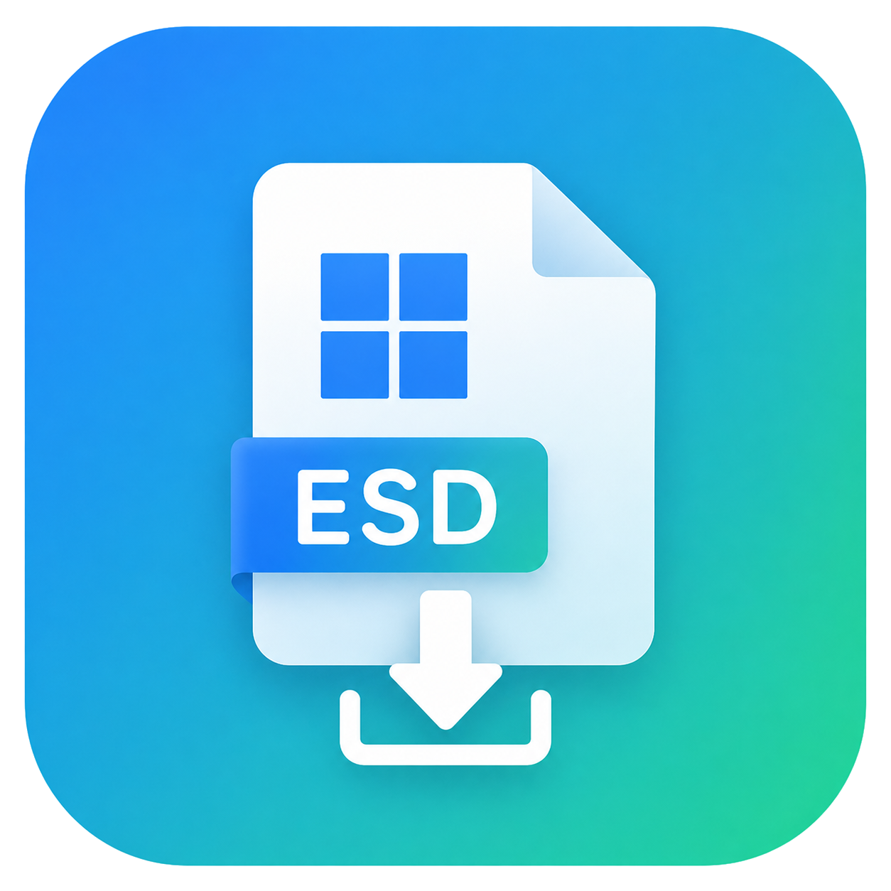
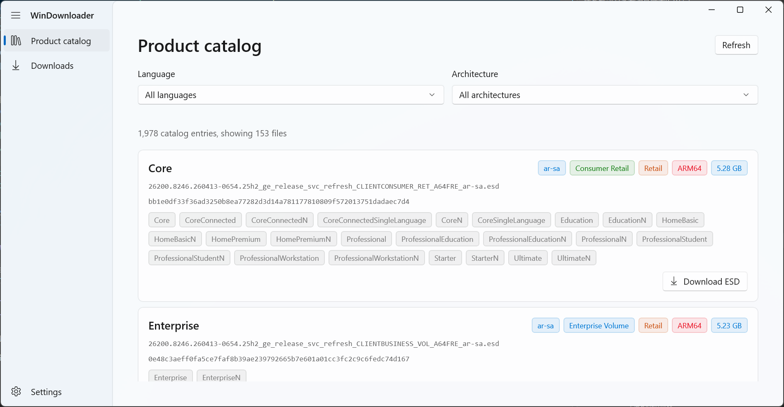
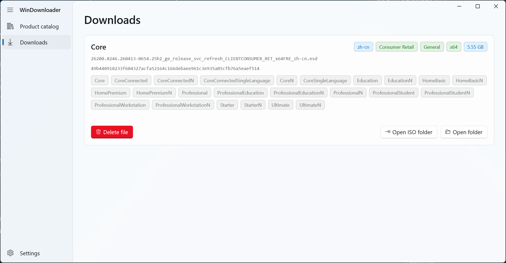
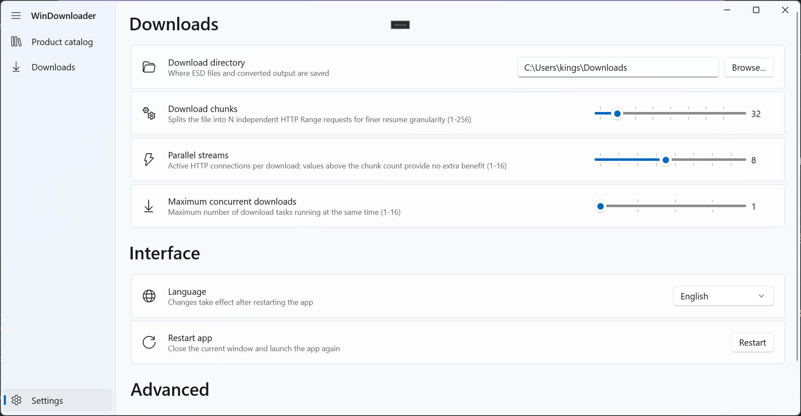

# WindowsImageDownloader

[](LICENSE)
[](https://dotnet.microsoft.com/)
[](https://docs.microsoft.com/en-us/windows/apps/winui/winui3/)
[](https://www.microsoft.com/windows)

<p align="center">
  
</p>

> **中文版说明请见 [README_ZH.md](README_ZH.md)**

A Windows installation image downloader built with **WinUI 3** and **.NET 10**. It fetches product catalogs from the **Microsoft Update Catalog**, filters ESD files, downloads them with multi-threaded resumable support, verifies SHA-256 checksums, persists tasks via SQLite, and optionally converts downloaded ESD files to bootable ISO images.

> Experimental project developed with AI coding agents; review and test changes before relying on them.

---

## ✨ Features

- **📦 Product Catalog Browsing** — Fetches and parses the official Microsoft Update Catalog (`products.cab` / `products.xml`), presenting available Windows images grouped by language and architecture.
- **⬇️ Multi-threaded Resumable Download** — Powered by the [Downloader](https://github.com/bezzad/Downloader) library. Supports pause, resume, and concurrent downloads with configurable limits.
- **🔐 SHA-256 Verification** — Automatically verifies the integrity of every downloaded ESD file against its published hash.
- **💾 SQLite Task Persistence** — Download tasks are persisted locally via SQLite. Tasks survive application restarts, and interrupted downloads can be resumed.
- **🔄 ESD → ISO Conversion** — After download, you can optionally convert ESD files into bootable ISO images. The conversion pipeline:
  - Extracts WIM images using **ManagedWimLib** (`WinDownloader.Wim`)
  - Reuses official solid LZMS compression for `sources\install.wim`
  - Creates the final ISO using the bundled **oscdimg** tool (`WinDownloader.Iso`)
- **🌐 Localization** — Supports **en-US** and **zh-CN** with MRT Core resources. Language switching takes effect after restart.

---

## 🖼️ Screenshots







---

## 🚀 Getting Started

### Runtime Environment (Using a Published Build)

- **Windows 11 x64** (build 26100 or later)
- An internet connection to retrieve the Microsoft Update Catalog and download ESD files
- Sufficient free disk space for the downloaded ESD files and generated ISO images

The published application uses Windows App SDK self-contained deployment. End users do **not** need to install the .NET 10 SDK or Visual Studio. Copy the complete publish directory to the target machine and start `WinDownloader.exe`.

### Development Environment

- **Windows 11 x64** (build 26100 or later)
- [.NET 10 SDK](https://dotnet.microsoft.com/download/dotnet/10.0)
- [Visual Studio 2026](https://visualstudio.microsoft.com/) (recommended), with:
  - .NET Desktop Development
  - Universal Windows Platform development
  - Windows App SDK C++ templates
- Git and an internet connection for restoring NuGet packages

### Build & Run from Source

```powershell
# Clone the repository
git clone https://github.com/your-username/WinDownloader.git
cd WinDownloader

# Restore dependencies
dotnet restore .\src\WinDownloader\WinDownloader.csproj

# Build the main WinUI application (x64 only)
dotnet build .\src\WinDownloader\WinDownloader.csproj -nologo -p:Platform=x64 -v minimal

# Run
dotnet run --project .\src\WinDownloader\WinDownloader.csproj -p:Platform=x64
```

> **Note:** The main application currently targets **x64** only. The platform must be explicitly specified when building.

### Publish a Self-Contained Build

```powershell
dotnet publish .\src\WinDownloader\WinDownloader.csproj -nologo -p:Platform=x64 -p:PublishDir=.\publish -v minimal
```

---

## 🏗️ Project Structure

```
src/
├── WinDownloader/              # Main WinUI 3 application
│   ├── App.xaml / .cs          # Host, DI, application lifecycle
│   ├── MainWindow.xaml / .cs   # NavigationView shell
│   ├── Interfaces/             # Service contracts
│   ├── Models/                 # Data models (DownloadTask, TaskState, etc.)
│   ├── Services/               # Service implementations
│   ├── ViewModels/             # MVVM ViewModels
│   ├── Views/                  # Pages and controls
│   └── Strings/                # Localization resources (.resw)
├── WinDownloader.Wim/          # ManagedWimLib wrapper library
├── WinDownloader.Iso/          # ISO packaging library (oscdimg wrapper)
├── POC/                        # Console proof-of-concept host
└── WinDownloader.slnx          # Solution file
```

---

## 📚 Documentation

Start with [AGENTS.md](AGENTS.md) for coding constraints or [docs/ARCHITECTURE.md](docs/ARCHITECTURE.md) for the system overview.

| Document                                                   | Description                                       |
| ---------------------------------------------------------- | ------------------------------------------------- |
| [docs/WORKFLOW.md](docs/WORKFLOW.md)                       | Standard workflow for AI agent                    |
| [docs/ARCHITECTURE.md](docs/ARCHITECTURE.md)               | Overall architecture, DI, data flow               |
| [docs/MODULE_CATALOG.md](docs/MODULE_CATALOG.md)           | Product catalog fetching                          |
| [docs/MODULE_DOWNLOAD.md](docs/MODULE_DOWNLOAD.md)         | ESD download, SHA-256, SQLite, task orchestration |
| [docs/MODULE_CONVERSION.md](docs/MODULE_CONVERSION.md)     | ESD → ISO conversion pipeline                     |
| [docs/MODULE_WIM.md](docs/MODULE_WIM.md)                   | `WinDownloader.Wim` shared library                |
| [docs/MODULE_ISO.md](docs/MODULE_ISO.md)                   | `WinDownloader.Iso` shared library                |
| [docs/MODULE_MODELS.md](docs/MODULE_MODELS.md)             | Data models                                       |
| [docs/MODULE_UI.md](docs/MODULE_UI.md)                     | WinUI pages, controls, ViewModels                 |
| [docs/MODULE_SETTINGS.md](docs/MODULE_SETTINGS.md)         | Settings service and settings page                |
| [docs/MODULE_LOCALIZATION.md](docs/MODULE_LOCALIZATION.md) | Localization with MRT Core                        |
| [docs/MODULE_PACKAGING.md](docs/MODULE_PACKAGING.md)       | Packaging and publishing                          |
| [docs/MODULE_POC.md](docs/MODULE_POC.md)                   | POC console host                                  |
| [CHANGELOG.md](CHANGELOG.md)                               | Release history                                   |

---

## 🧪 Proof-of-Concept (POC)

The console host tests WIM/ISO conversion, compression and progress without WinUI. Options and output paths are documented in [src/POC/README.md](src/POC/README.md).

```powershell
dotnet run --project .\src\POC\POC.csproj -- --help
```

---

## 🤝 Contributing

Follow [docs/WORKFLOW.md](docs/WORKFLOW.md), keep changes scoped, and include verification results and matching documentation in your pull request.

---

## 📄 License

This project is licensed under the **GNU General Public License v3.0** — see the [LICENSE](LICENSE) file for details.

---

## 📚 References

- [Downloader](https://github.com/bezzad/Downloader) — Multi-threaded download library
- [ManagedWimLib](https://github.com/kingseva/ManagedWimLib) — .NET wrapper for wimlib
- [CommunityToolkit.Mvvm](https://github.com/CommunityToolkit/dotnet) — MVVM toolkit
- [CommunityToolkit.WinUI](https://github.com/CommunityToolkit/Windows) — WinUI controls
- [oscdimg](https://learn.microsoft.com/en-us/windows-hardware/manufacture/desktop/oscdimg-command-line-options) — Windows ISO creation tool
- [Microsoft Update Catalog](https://www.catalog.update.microsoft.com/) — Windows image source
