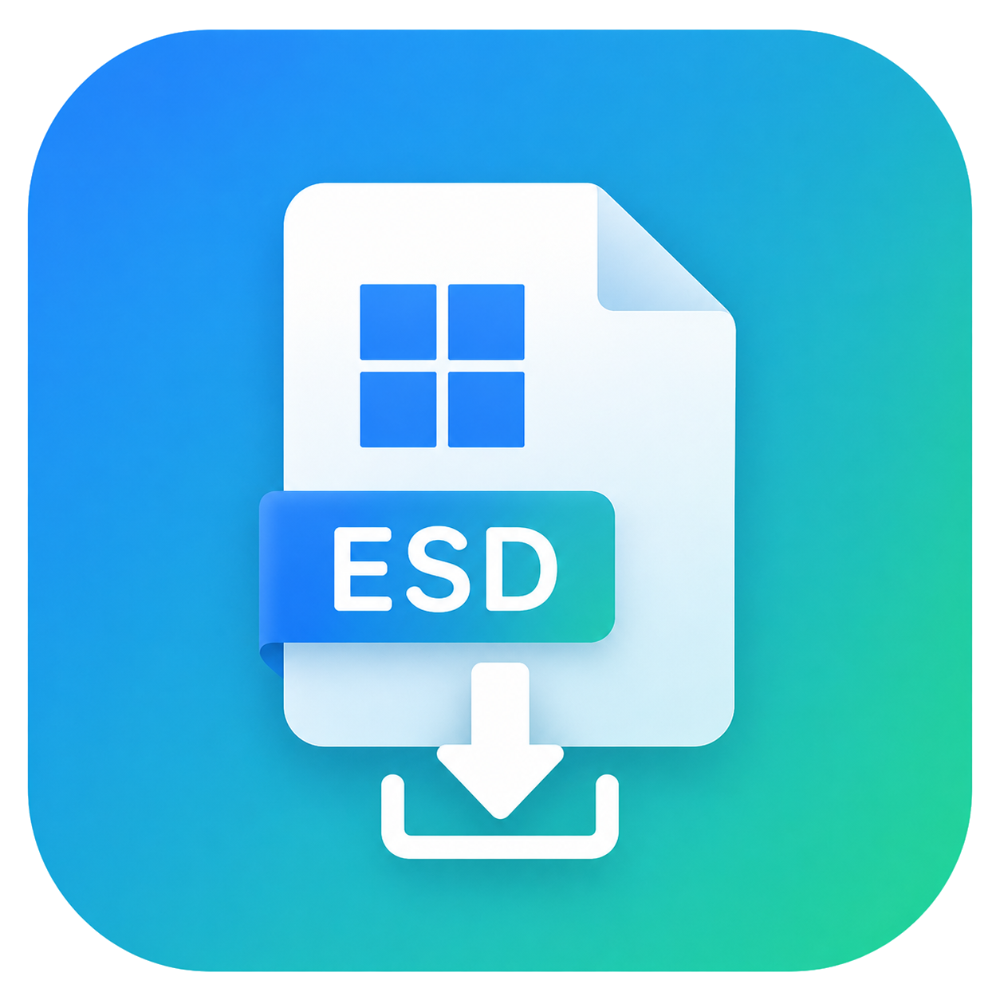
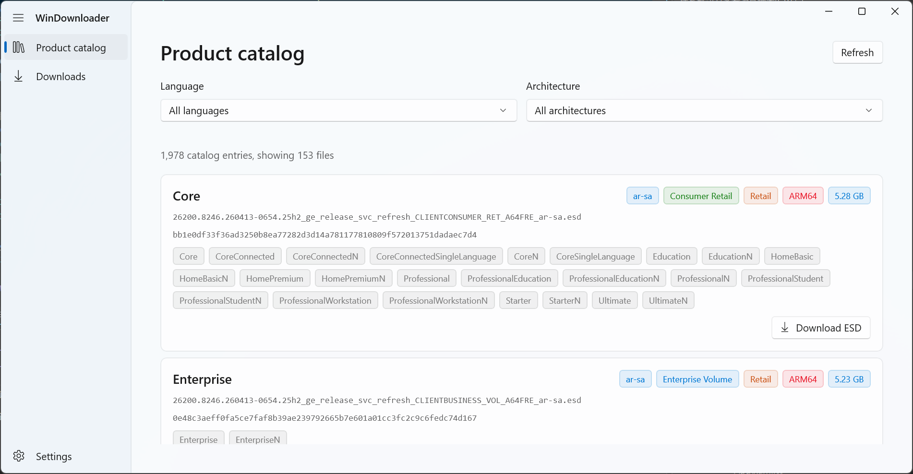
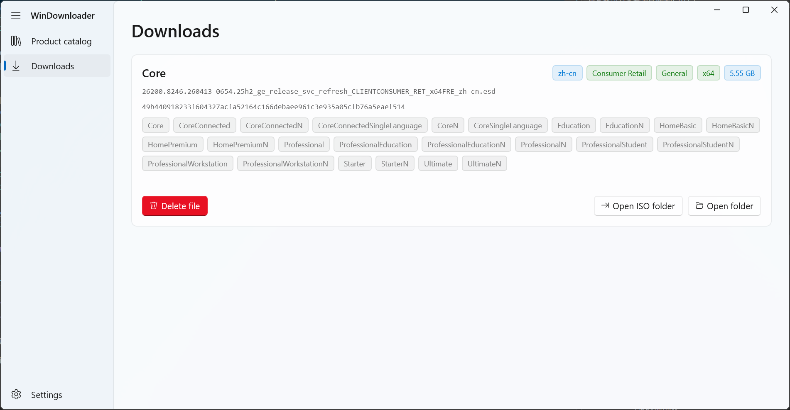

# WindowsImageDownloader

[](LICENSE)
[](https://dotnet.microsoft.com/)
[](https://docs.microsoft.com/zh-cn/windows/apps/winui/winui3/)
[](https://www.microsoft.com/windows)

<p align="center">
  
</p>

> **English version: [README.md](README.md)**

一个基于 **WinUI 3** 和 **.NET 10** 的 Windows 安装映像下载工具。从 **Microsoft Update Catalog** 获取产品目录、筛选 ESD 文件、多线程断点续传下载、SHA-256 校验、SQLite 任务持久化，并支持将下载完成的 ESD 文件转换为可启动的 ISO 映像。

> 💡 **提示：** 本项目是一个**试验场**，代码库中大量内容由 **AI coding Agent** 生成和迭代。代码中可能存在实验性的模式、偶尔的过度设计以及随处可见的 AI 生成代码。欢迎贡献和清理！

---

## ✨ 功能特性

- **📦 产品目录浏览** — 从 Microsoft Update Catalog 获取并解析官方产品目录（`products.cab` / `products.xml`），按语言和架构分组展示可用的 Windows 映像。
- **⬇️ 多线程断点续传下载** — 基于 [Downloader](https://github.com/bezzad/Downloader) 库，支持暂停、恢复和可配置的并发下载数。
- **🔐 SHA-256 校验** — 自动对每个下载完成的 ESD 文件进行 SHA-256 哈希校验，确保文件完整性。
- **💾 SQLite 任务持久化** — 下载任务通过 SQLite 本地持久化，应用重启后任务不丢失，中断的下载可恢复。
- **🔄 ESD → ISO 转换** — 下载完成后，可选择将 ESD 文件转换为可启动的 ISO 映像。转换流水线：
  - 使用 **ManagedWimLib** 提取 WIM 映像（`WinDownloader.Wim`）
  - 复用官方 solid LZMS 压缩格式生成 `sources\install.wim`
  - 使用内置的 **oscdimg** 工具创建最终 ISO（`WinDownloader.Iso`）
- **🌐 本地化支持** — 支持 **en-US** 和 **zh-CN**，基于 MRT Core 资源系统，切换语言后重启生效。
- **🎨 现代化 WinUI 3 界面** — 基于 Windows App SDK 2.0，包含导航视图、设置页面和实时下载进度显示。

---

## 🖼️ 截图





---

## 🚀 快速开始

### 使用环境（运行已发布版本）

运行已发布版本需要：

- **Windows 11 x64**（build 26100 或更高版本）
- 可访问网络，用于获取 Microsoft Update Catalog 产品目录和下载 ESD 文件
- 足够的磁盘空间，用于保存 ESD 文件和生成 ISO 映像

发布版本采用 Windows App SDK self-contained 部署，用户**不需要**额外安装 .NET 10 SDK 或 Visual Studio。请将完整的发布目录复制到目标计算机，然后运行 `WinDownloader.exe`。

### 开发环境

构建或修改本项目需要准备：

- **Windows 11 x64**（build 26100 或更高版本）
- [.NET 10 SDK](https://dotnet.microsoft.com/download/dotnet/10.0)
- [Visual Studio 2026](https://visualstudio.microsoft.com/zh-hans/)（推荐），需安装以下工作负载：
  - .NET 桌面开发
  - 通用 Windows 平台开发
  - Windows App SDK C++ 模板
- Git，以及用于还原 NuGet 包的网络连接

### 从源码构建与运行

```powershell
# 克隆仓库
git clone https://github.com/your-username/WinDownloader.git
cd WinDownloader

# 还原依赖
dotnet restore .\src\WinDownloader\WinDownloader.csproj

# 构建主 WinUI 应用（仅 x64）
dotnet build .\src\WinDownloader\WinDownloader.csproj -nologo -p:Platform=x64 -v minimal

# 运行
dotnet run --project .\src\WinDownloader\WinDownloader.csproj -p:Platform=x64
```

> **注意：** 主应用目前仅支持 **x64** 架构，构建时必须显式指定平台。

### 发布自包含版本

```powershell
dotnet publish .\src\WinDownloader\WinDownloader.csproj -nologo -p:Platform=x64 -p:PublishDir=.\publish -v minimal
```

---

## 🏗️ 项目结构

```
src/
├── WinDownloader/              # 主 WinUI 3 应用
│   ├── App.xaml / .cs          # 宿主、DI、应用生命周期
│   ├── MainWindow.xaml / .cs   # NavigationView 导航壳
│   ├── Interfaces/             # 服务接口
│   ├── Models/                 # 数据模型（DownloadTask、TaskState 等）
│   ├── Services/               # 服务实现
│   ├── ViewModels/             # MVVM ViewModel
│   ├── Views/                  # 页面和控件
│   └── Strings/                # 本地化资源文件 (.resw)
├── WinDownloader.Wim/          # ManagedWimLib 封装库
├── WinDownloader.Iso/          # ISO 打包库（oscdimg 封装）
├── POC/                        # 控制台验证宿主
└── WinDownloader.slnx          # 解决方案文件
```

---

## 🧱 架构概览

| 层级          | 技术                                                       |
| ------------- | ---------------------------------------------------------- |
| UI 框架       | WinUI 3（`Microsoft.UI.Xaml`）                             |
| 运行时        | .NET 10 + Windows App SDK 2.0                              |
| MVVM          | CommunityToolkit.Mvvm                                      |
| DI / 生命周期 | Microsoft.Extensions.Hosting + DI                          |
| 下载引擎      | [Downloader](https://github.com/bezzad/Downloader) NuGet   |
| WIM 处理      | [ManagedWimLib](https://github.com/kingseva/ManagedWimLib) |
| ISO 创建      | 内置 `oscdimg.exe`                                         |
| 数据库        | Microsoft.Data.Sqlite                                      |
| 设置存储      | JSON 文件                                                  |

### 数据流

```
选择页面
  → 从 Microsoft Update Catalog 获取目录
  → 解析 products.xml → RawFile 列表
  → 用户选择并排队下载
  → DownloadTaskOrchestratorService 调度任务
  → EsdDownloadPipeline 下载 + SHA-256 校验
  → SQLite 持久化任务状态
  → （可选）EsdToIsoConversionService 将 ESD 转换为 ISO
```

---

## 📚 文档

| 文档                                                       | 说明                                |
| ---------------------------------------------------------- | ----------------------------------- |
| [docs/WORKFLOW.md](docs/WORKFLOW.md)                       | AI Agent标准工作流程                |
| [docs/ARCHITECTURE.md](docs/ARCHITECTURE.md)               | 总体架构、DI、数据流                |
| [docs/MODULE_CATALOG.md](docs/MODULE_CATALOG.md)           | 产品目录获取                        |
| [docs/MODULE_DOWNLOAD.md](docs/MODULE_DOWNLOAD.md)         | ESD 下载、SHA-256、SQLite、任务编排 |
| [docs/MODULE_CONVERSION.md](docs/MODULE_CONVERSION.md)     | ESD → ISO 转换流水线                |
| [docs/MODULE_WIM.md](docs/MODULE_WIM.md)                   | `WinDownloader.Wim` 共享库          |
| [docs/MODULE_ISO.md](docs/MODULE_ISO.md)                   | `WinDownloader.Iso` 共享库          |
| [docs/MODULE_MODELS.md](docs/MODULE_MODELS.md)             | 数据模型                            |
| [docs/MODULE_UI.md](docs/MODULE_UI.md)                     | WinUI 页面、控件、ViewModel         |
| [docs/MODULE_SETTINGS.md](docs/MODULE_SETTINGS.md)         | 设置服务和设置页                    |
| [docs/MODULE_LOCALIZATION.md](docs/MODULE_LOCALIZATION.md) | MRT Core 本地化                     |
| [docs/MODULE_PACKAGING.md](docs/MODULE_PACKAGING.md)       | 打包与发布                          |
| [docs/MODULE_POC.md](docs/MODULE_POC.md)                   | POC 控制台宿主                      |
| [CHANGELOG.md](CHANGELOG.md)                               | 版本更新记录                        |

---

## 🧪 概念验证（POC）

`src/POC` 目录包含一个控制台应用，直接引用 `WinDownloader.Wim` 和 `WinDownloader.Iso`，用于独立验证和实验：

- 独立测试 WIM/ISO 转换逻辑
- 实验进度映射和压缩参数
- 验证 oscdimg 行为

```powershell
dotnet run --project .\src\POC\POC.csproj
```

---

## 🤝 贡献指南

欢迎贡献代码！请先阅读我们的[贡献指南](docs/WORKFLOW.md)。

1. Fork 本仓库
2. 创建功能分支（`git checkout -b feature/amazing-feature`）
3. 提交更改（`git commit -m '添加某个很棒的功能'`）
4. 推送到分支（`git push origin feature/amazing-feature`）
5. 发起 Pull Request

---

## 📄 许可证

本项目基于 **GNU General Public License v3.0** 开源 — 详见 [LICENSE](LICENSE) 文件。

---

## 📚 参考

- [Downloader](https://github.com/bezzad/Downloader) — 多线程下载库
- [ManagedWimLib](https://github.com/kingseva/ManagedWimLib) — wimlib 的 .NET 封装
- [CommunityToolkit.Mvvm](https://github.com/CommunityToolkit/dotnet) — MVVM 工具包
- [CommunityToolkit.WinUI](https://github.com/CommunityToolkit/Windows) — WinUI 控件库
- [oscdimg](https://learn.microsoft.com/zh-cn/windows-hardware/manufacture/desktop/oscdimg-command-line-options) — Windows ISO 创建工具
- [Microsoft Update Catalog](https://www.catalog.update.microsoft.com/) — Windows 映像来源
