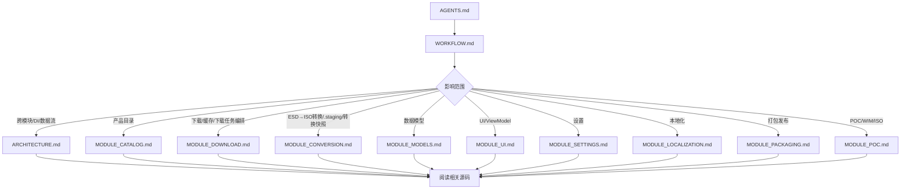

# WindowsImageDownloader — 标准工作流程

> 适用对象：AI Agent。接到修改任务时，先从仓库根目录的 [AGENTS.md](../AGENTS.md) 确认边界，再按本文档选择模块文档和源码。

## 核心原则

1. 先理解，后修改。
2. 文档与代码同步维护。
3. 主应用当前包含 ESD 下载和可选 ISO 转换；POC 是控制台验证和对照宿主。
4. 下载路径、下载校验、ISO 转换、任务编排、缓存持久化和 UI 绑定保持职责分离。
5. ISO 转换不写入 SQLite，不新增下载任务 `Converting` 状态，除非先完成新的生命周期设计。
6. 发现需求边界不清时先确认，再实施跨模块修改。

## 文档体系

| 层级 | 文档 | 什么时候读 |
|------|------|------------|
| 入口 | [AGENTS.md](../AGENTS.md) | 每次接手仓库任务时先读，确认当前产品边界和快速避坑 |
| 工作流 | [WORKFLOW.md](WORKFLOW.md) | 确定阅读路径、修改顺序和验证方式 |
| 总体架构 | [ARCHITECTURE.md](ARCHITECTURE.md) | 涉及 DI、生命周期、数据流、线程模型、服务层组织或模块边界时 |
| 产品目录 | [MODULE_CATALOG.md](MODULE_CATALOG.md) | 修改 Microsoft Update Catalog、CAB/XML 缓存、RawFile 解析时 |
| 下载模块 | [MODULE_DOWNLOAD.md](MODULE_DOWNLOAD.md) | 修改 ESD 下载、SHA-256 校验、SQLite 缓存、下载任务编排时 |
| 转换调度 | [MODULE_CONVERSION.md](MODULE_CONVERSION.md) | 修改用户手动触发的 ESD 到 ISO 转换、`.staging`、转换快照、active count 时 |
| 数据模型 | [MODULE_MODELS.md](MODULE_MODELS.md) | 修改 RawFile、DownloadTask、TaskState、ISO/WIM 模型或持久化字段时 |
| UI 层 | [MODULE_UI.md](MODULE_UI.md) | 修改 WinUI 页面、控件、ViewModel、导航或绑定线程时 |
| 设置 | [MODULE_SETTINGS.md](MODULE_SETTINGS.md) | 修改 IAppSettings、设置默认值、设置页或 JSON 存储时 |
| 本地化 | [MODULE_LOCALIZATION.md](MODULE_LOCALIZATION.md) | 修改 `.resw`、`x:Uid`、语言选择、PRI 资源或本地化构建行为时 |
| 打包发布 | [MODULE_PACKAGING.md](MODULE_PACKAGING.md) | 修改 csproj、NuGet、Windows App SDK、发布参数、打包资产时 |
| POC 验证 | [MODULE_POC.md](MODULE_POC.md) | 修改 `src/POC`、`WinDownloader.Wim`、`WinDownloader.Iso`、oscdimg、WIM/ISO 验证逻辑时 |

## 推荐阅读路径



跨模块任务通常需要同时阅读 [ARCHITECTURE.md](ARCHITECTURE.md) 和所有受影响的 `MODULE_*.md`，不要只看流程图中的单一路径。

## 实施流程

### 1. 确定范围

先判断改动属于主应用、POC，还是两者都要同步：

| 范围 | 允许内容 | 禁止混入 |
|------|----------|----------|
| `src/WinDownloader` | 目录获取、ESD 下载、SHA-256 校验、任务缓存、WinUI 管理、完成后 ISO 转换入口 | 未设计的格式选择、ISO 转换持久化、下载任务 `Converting` 状态 |
| `src/POC` | WIM/ISO 控制台验证、进度映射实验、服务对照实现 | 主应用 UI、SQLite schema 和用户可见产品承诺 |

### 2. 阅读文档和源码

按文档中的文件清单定位源码，重点看：

- 构造函数和 dispose 生命周期。
- DI 注册和 `IHostedService` 启停顺序。
- 事件订阅/退订。
- UI 线程 marshal 规则。
- SQLite schema、映射和自动重建策略。
- ISO 转换取消、`.staging` 清理和 oscdimg 进程处理。

### 3. 编码修改

保持项目风格：

- file-scoped namespace。
- 非公开实现优先 `internal sealed`，公开服务按现有风格。
- xml-doc 使用 `<summary>`、`<param>`、`<returns>`、`<see cref="..."/>`。
- 复杂区域使用 `// ── Section ───` 风格分隔。
- 不把路径拼接放回模型或 UI，使用 `IDownloadTaskPathService`。
- 不把下载/校验细节放回 orchestrator，使用 `IEsdDownloadPipeline`。
- 不把 WIM/oscdimg 细节放进 ViewModel，使用主应用 `IEsdToIsoConversionService` 和共享库后端服务。

### 4. 更新文档

代码改动后同步更新：

| 改动 | 必更文档 |
|------|----------|
| 文档结构新增、删除、改名 | [AGENTS.md](../AGENTS.md)、[WORKFLOW.md](WORKFLOW.md)、[README.md](../README.md) 中的文档入口 |
| 主项目边界、DI、生命周期、数据流变化 | [ARCHITECTURE.md](ARCHITECTURE.md) |
| 产品目录、CAB/XML 缓存、RawFile 解析变化 | [MODULE_CATALOG.md](MODULE_CATALOG.md)，必要时更新 [MODULE_MODELS.md](MODULE_MODELS.md) |
| ESD 下载、路径解析、校验、任务编排变化 | [MODULE_DOWNLOAD.md](MODULE_DOWNLOAD.md)，必要时更新 [ARCHITECTURE.md](ARCHITECTURE.md) |
| ISO 转换调度、WIM/ISO 服务、`.staging`、active count 变化 | [MODULE_CONVERSION.md](MODULE_CONVERSION.md)、[MODULE_UI.md](MODULE_UI.md)、[MODULE_MODELS.md](MODULE_MODELS.md)、[ARCHITECTURE.md](ARCHITECTURE.md) |
| SQLite schema 或任务字段变化 | [MODULE_DOWNLOAD.md](MODULE_DOWNLOAD.md)、[MODULE_MODELS.md](MODULE_MODELS.md) |
| ViewModel、页面、控件、绑定线程变化 | [MODULE_UI.md](MODULE_UI.md)，必要时更新对应业务模块文档 |
| 设置项、默认值、范围、JSON key 变化 | [MODULE_SETTINGS.md](MODULE_SETTINGS.md) |
| `.resw`、`x:Uid`、语言选择、PRI 资源行为变化 | [MODULE_LOCALIZATION.md](MODULE_LOCALIZATION.md)，必要时更新 [MODULE_UI.md](MODULE_UI.md)、[MODULE_SETTINGS.md](MODULE_SETTINGS.md)、[MODULE_PACKAGING.md](MODULE_PACKAGING.md) |
| NuGet、TargetFramework、Windows App SDK、发布配置变化 | [MODULE_PACKAGING.md](MODULE_PACKAGING.md)，必要时更新 [ARCHITECTURE.md](ARCHITECTURE.md) |
| POC 后处理实验、共享 WIM/ISO 库、oscdimg 变化 | [MODULE_POC.md](MODULE_POC.md)、[MODULE_PACKAGING.md](MODULE_PACKAGING.md)，若主项目同步变更也更新主项目模块文档 |

### 5. 验证

修改主项目代码后至少运行：

```powershell
dotnet build .\src\WinDownloader\WinDownloader.csproj -nologo -p:Platform=x64 -v minimal
```

如果只修改 Markdown，可改为检查链接、旧文档名和模块索引是否一致。修改 UI 或 XAML 时，额外检查 VS Code Problems / XAML 诊断。

## 常见场景

### 新增设置项

1. `src/WinDownloader/Interfaces/IAppSettings.cs`
2. `src/WinDownloader/Services/AppSettingsService.cs`
3. `src/WinDownloader/ViewModels/SettingsViewModel.cs`
4. `src/WinDownloader/Views/Pages/SettingsPage.xaml`
5. [MODULE_SETTINGS.md](MODULE_SETTINGS.md)

### 修改 SQLite schema

1. `CacheService.CreateTableSql`
2. `CacheService.RequiredColumns`
3. `CacheService.MapToTask()`
4. `CacheService.BindAllParameters()`
5. `CacheService.UpdateTaskAsync()`
6. `DownloadTask` 对应属性
7. [MODULE_DOWNLOAD.md](MODULE_DOWNLOAD.md) 和 [MODULE_MODELS.md](MODULE_MODELS.md)

注意：老缓存会自动删除重建，任务历史会丢失。

### 修改下载管道

1. 阅读 [MODULE_DOWNLOAD.md](MODULE_DOWNLOAD.md)。
2. 检查 `DownloadTaskOrchestratorService`、`EsdDownloadPipeline`、`DownloadService`、`DownloadTaskPathService`。
3. 保持状态编排、下载/校验、路径解析三个职责分离。
4. 更新 [MODULE_DOWNLOAD.md](MODULE_DOWNLOAD.md) 和必要的架构文档。

### 修改 ISO 转换

1. 阅读 [MODULE_CONVERSION.md](MODULE_CONVERSION.md)、[MODULE_UI.md](MODULE_UI.md)、[MODULE_MODELS.md](MODULE_MODELS.md)。
2. 检查 `EsdToIsoOrchestratorService`、`EsdToIsoConversionService`、`WinDownloader.Iso`、`WinDownloader.Wim`、`DownloadTaskPathService`。
3. 保持 ISO 转换单并发；下载页聚合下载编排和 ISO 编排的 `ActiveTaskCount`。
4. `.staging` 目录由 `IDownloadTaskPathService.ResolveIsoStagingDirectory()` 解析，默认完成或取消后尽力清理。
5. 不把转换快照写入 SQLite；需要恢复/重试时先设计新的持久化模型。

### 修改 UI 或 ViewModel

1. 阅读 [MODULE_UI.md](MODULE_UI.md) 和对应业务模块文档。
2. 确认 `ObservableCollection`、绑定属性和命令状态只在 UI 线程更新。
3. 后台任务通知使用快照对象，经 `DispatcherQueue.TryEnqueue` 应用到绑定属性。
4. 修改 XAML 后检查绑定名、命令名和 VS Code Problems。

### POC 后处理实验

1. 在 `src/POC` 内实现和验证。
2. 更新 [MODULE_POC.md](MODULE_POC.md)。
3. 若同一能力已同步到主项目，也同步更新 [ARCHITECTURE.md](ARCHITECTURE.md)、[MODULE_CONVERSION.md](MODULE_CONVERSION.md)、[MODULE_UI.md](MODULE_UI.md)、[MODULE_MODELS.md](MODULE_MODELS.md) 和 [MODULE_PACKAGING.md](MODULE_PACKAGING.md)。
4. POC 可以比主应用暴露更多诊断开关，但不要把 POC-only 行为写成 WinUI 产品承诺。

## 最终检查清单

- [ ] 文档入口与实际文件一致，尤其是 [AGENTS.md](../AGENTS.md)、[WORKFLOW.md](WORKFLOW.md)、[README.md](../README.md)。
- [ ] 文档中的文件路径与实际代码一致。
- [ ] 新增/删除 DI 注册已同步到 [ARCHITECTURE.md](ARCHITECTURE.md)。
- [ ] SQLite schema、模型字段和文档一致。
- [ ] 设置默认值、范围、UI 控件和 [MODULE_SETTINGS.md](MODULE_SETTINGS.md) 一致。
- [ ] ISO 转换状态边界一致：不写 SQLite、不扩展下载任务 state、通过独立快照更新 UI。
- [ ] 没有旧文档名或过时链接。
- [ ] 修改代码时，`dotnet build .\src\WinDownloader\WinDownloader.csproj -nologo -p:Platform=x64 -v minimal` 通过。
