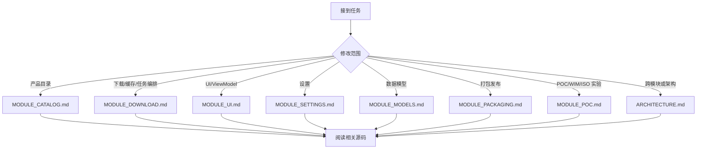

# WindowsImageDownloader — 标准工作流程

> 适用对象：AI Agent。接到修改任务时，先阅读本文件，再按影响范围阅读模块文档和源码。

## 核心原则

1. 先理解，后修改。
2. 文档与代码同步维护。
3. 主应用保持 ESD-only，WIM/ISO 后处理先在 POC 验证。
4. 避免过长单文件，按职责拆分服务、模型和 UI。
5. 发现需求边界不清时先确认，再实施大范围修改。

## 推荐阅读路径



## 实施流程

### 1. 阅读文档和源码

重点看：

- 构造函数和 dispose 生命周期。
- DI 注册和 `IHostedService` 启停顺序。
- 事件订阅/退订。
- UI 线程 marshal 规则。
- SQLite schema、映射和自动重建策略。

### 2. 编码修改

保持项目风格：

- file-scoped namespace。
- 非公开实现优先 `internal sealed`，公开服务按现有风格。
- xml-doc 使用 `<summary>`、`<param>`、`<returns>`、`<see cref="..."/>`。
- 复杂区域使用 `// ── Section ───` 风格分隔。
- 不把路径拼接放回模型或 UI，使用 `IDownloadTaskPathService`。
- 不把下载/校验细节放回 orchestrator，使用 `IEsdDownloadPipeline`。

### 3. 更新文档

代码改动后同步更新：

| 改动 | 必更文档 |
|------|----------|
| 新增/删除文件 | 对应 `MODULE_*.md` |
| DI 注册变化 | `ARCHITECTURE.md` |
| 数据流变化 | `ARCHITECTURE.md`、对应模块文档 |
| SQLite schema 变化 | `MODULE_DOWNLOAD.md`、`MODULE_MODELS.md` |
| 设置项变化 | `MODULE_SETTINGS.md` |
| NuGet/发布配置变化 | `MODULE_PACKAGING.md` |
| POC 后处理实验 | `MODULE_POC.md` |

### 4. 验证

至少运行：

```powershell
dotnet build src/WindowsImageDownloader.slnx
```

如果修改 UI 或 XAML，额外检查 VS Code Problems / XAML 诊断。

## 常见场景

### 新增设置项

1. `Interfaces/IAppSettings.cs`
2. `Services/AppSettingsService.cs`
3. `ViewModels/SettingsViewModel.cs`
4. `Views/Pages/SettingsPage.xaml`
5. `docs/MODULE_SETTINGS.md`

### 修改 SQLite schema

1. `CacheService.CreateTableSql`
2. `CacheService.RequiredColumns`
3. `CacheService.MapToTask()`
4. `CacheService.BindAllParameters()`
5. `CacheService.UpdateTaskAsync()`
6. `DownloadTask` 对应属性
7. `docs/MODULE_DOWNLOAD.md` 和 `docs/MODULE_MODELS.md`

注意：老缓存会自动删除重建，任务历史会丢失。

### 修改下载管道

1. 阅读 `MODULE_DOWNLOAD.md`。
2. 检查 `TaskOrchestratorService`、`EsdDownloadPipeline`、`DownloadService`、`DownloadTaskPathService`。
3. 保持状态编排、下载/校验、路径解析三个职责分离。
4. 更新 `MODULE_DOWNLOAD.md` 和必要的架构文档。

### POC 后处理实验

1. 在 `src/POC` 内实现和验证。
2. 更新 `docs/MODULE_POC.md`。
3. 不修改主应用文档来宣称未回迁的能力。
4. 只有用户明确要求回迁时，再设计主项目 API、UI、缓存和错误恢复策略。

## 最终检查清单

- [ ] `dotnet build src/WindowsImageDownloader.slnx` 通过。
- [ ] 文档中的文件路径与实际代码一致。
- [ ] 主项目没有残留 WIM/ISO 运行路径或依赖。
- [ ] 新增/删除 DI 注册已同步到 `ARCHITECTURE.md`。
- [ ] SQLite schema、模型字段和文档一致。
- [ ] 没有留下过时 TODO 或注释。
