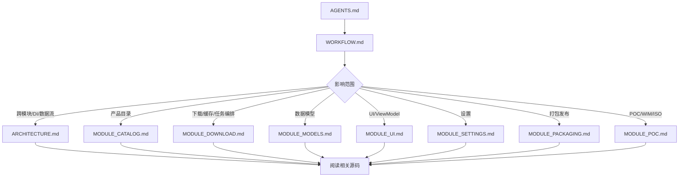

# WindowsImageDownloader — 标准工作流程

> 适用对象：AI Agent。接到修改任务时，先从仓库根目录的 [AGENTS.md](../AGENTS.md) 确认边界，再按本文档选择模块文档和源码。

## 核心原则

1. 先理解，后修改。
2. 文档与代码同步维护。
3. 主应用保持 ESD-only，WIM/ISO 后处理只在 POC 验证，除非用户明确要求回迁。
4. 下载路径、下载校验、任务编排、缓存持久化和 UI 绑定保持职责分离。
5. 发现需求边界不清时先确认，再实施跨模块修改。

## 文档体系

| 层级 | 文档 | 什么时候读 |
|------|------|------------|
| 入口 | [AGENTS.md](../AGENTS.md) | 每次接手仓库任务时先读，确认主应用边界和快速避坑 |
| 工作流 | [WORKFLOW.md](WORKFLOW.md) | 确定阅读路径、修改顺序和验证方式 |
| 总体架构 | [ARCHITECTURE.md](ARCHITECTURE.md) | 涉及 DI、生命周期、数据流、线程模型或模块边界时 |
| 产品目录 | [MODULE_CATALOG.md](MODULE_CATALOG.md) | 修改 Microsoft Update Catalog、CAB/XML 缓存、RawFile 解析时 |
| 下载管道 | [MODULE_DOWNLOAD.md](MODULE_DOWNLOAD.md) | 修改 ESD 下载、SHA-256 校验、SQLite 缓存、任务编排时 |
| 数据模型 | [MODULE_MODELS.md](MODULE_MODELS.md) | 修改 RawFile、DownloadTask、TaskState 或持久化字段时 |
| UI 层 | [MODULE_UI.md](MODULE_UI.md) | 修改 WinUI 页面、控件、ViewModel、导航或绑定线程时 |
| 设置 | [MODULE_SETTINGS.md](MODULE_SETTINGS.md) | 修改 IAppSettings、设置默认值、设置页或 JSON 存储时 |
| 打包发布 | [MODULE_PACKAGING.md](MODULE_PACKAGING.md) | 修改 csproj、NuGet、Windows App SDK、发布参数时 |
| POC 实验 | [MODULE_POC.md](MODULE_POC.md) | 修改 `src/POC`、ManagedWimLib、oscdimg、WIM/ISO 实验时 |

## 推荐阅读路径



跨模块任务通常需要同时阅读 [ARCHITECTURE.md](ARCHITECTURE.md) 和所有受影响的 `MODULE_*.md`，不要只看流程图中的单一路径。

## 实施流程

### 1. 确定范围

先判断改动属于主应用还是 POC：

| 范围 | 允许内容 | 禁止混入 |
|------|----------|----------|
| `src/WindowsImageDownloader` | 目录获取、ESD 下载、SHA-256 校验、任务缓存、WinUI 管理 | `OutputFormat`、ManagedWimLib、oscdimg、WIM/ISO 转换状态和转换管道 |
| `src/POC` | WIM/ISO 后处理概念验证、实验性模型和服务 | 主应用未设计完成的 UI、缓存 schema 和任务状态承诺 |

### 2. 阅读文档和源码

按文档中的文件清单定位源码，重点看：

- 构造函数和 dispose 生命周期。
- DI 注册和 `IHostedService` 启停顺序。
- 事件订阅/退订。
- UI 线程 marshal 规则。
- SQLite schema、映射和自动重建策略。

### 3. 编码修改

保持项目风格：

- file-scoped namespace。
- 非公开实现优先 `internal sealed`，公开服务按现有风格。
- xml-doc 使用 `<summary>`、`<param>`、`<returns>`、`<see cref="..."/>`。
- 复杂区域使用 `// ── Section ───` 风格分隔。
- 不把路径拼接放回模型或 UI，使用 `IDownloadTaskPathService`。
- 不把下载/校验细节放回 orchestrator，使用 `IEsdDownloadPipeline`。

### 4. 更新文档

代码改动后同步更新：

| 改动 | 必更文档 |
|------|----------|
| 文档结构新增、删除、改名 | [AGENTS.md](../AGENTS.md)、[WORKFLOW.md](WORKFLOW.md)、[README.md](../README.md) 中的文档入口 |
| 主项目边界、DI、生命周期、数据流变化 | [ARCHITECTURE.md](ARCHITECTURE.md) |
| 产品目录、CAB/XML 缓存、RawFile 解析变化 | [MODULE_CATALOG.md](MODULE_CATALOG.md)，必要时更新 [MODULE_MODELS.md](MODULE_MODELS.md) |
| ESD 下载、路径解析、校验、任务编排变化 | [MODULE_DOWNLOAD.md](MODULE_DOWNLOAD.md)，必要时更新 [ARCHITECTURE.md](ARCHITECTURE.md) |
| SQLite schema 或任务字段变化 | [MODULE_DOWNLOAD.md](MODULE_DOWNLOAD.md)、[MODULE_MODELS.md](MODULE_MODELS.md) |
| ViewModel、页面、控件、绑定线程变化 | [MODULE_UI.md](MODULE_UI.md)，必要时更新对应业务模块文档 |
| 设置项、默认值、范围、JSON key 变化 | [MODULE_SETTINGS.md](MODULE_SETTINGS.md) |
| NuGet、TargetFramework、Windows App SDK、发布配置变化 | [MODULE_PACKAGING.md](MODULE_PACKAGING.md)，必要时更新 [ARCHITECTURE.md](ARCHITECTURE.md) |
| POC 后处理实验、ManagedWimLib、oscdimg 变化 | [MODULE_POC.md](MODULE_POC.md)、[MODULE_PACKAGING.md](MODULE_PACKAGING.md) |

### 5. 验证

修改代码后至少运行：

```powershell
dotnet build src/WindowsImageDownloader.slnx
```

如果只修改 Markdown，可改为检查链接、旧文档名和模块索引是否一致。修改 UI 或 XAML 时，额外检查 VS Code Problems / XAML 诊断。

## 常见场景

### 新增设置项

1. `src/WindowsImageDownloader/Interfaces/IAppSettings.cs`
2. `src/WindowsImageDownloader/Services/AppSettingsService.cs`
3. `src/WindowsImageDownloader/ViewModels/SettingsViewModel.cs`
4. `src/WindowsImageDownloader/Views/Pages/SettingsPage.xaml`
5. [MODULE_SETTINGS.md](MODULE_SETTINGS.md)

### 修改 SQLite schema

1. `CacheService.CreateTableSql`
2. `CacheService.RequiredColumns`
3. `CacheService.MapToTask()`
4. `CacheService.BindAllParameters()`
5. `CacheService.UpdateTaskAsync()`
6. `DownloadTask` 对应属性
7. [MODULE_DOWNLOAD.md](MODULE_DOWNLOAD.md) 和 [MODULE_MODELS.md](MODULE_MODELS.md)

注意：老缓存会自动删除重建，任务历史会丢失。

### 修改下载管道

1. 阅读 [MODULE_DOWNLOAD.md](MODULE_DOWNLOAD.md)。
2. 检查 `TaskOrchestratorService`、`EsdDownloadPipeline`、`DownloadService`、`DownloadTaskPathService`。
3. 保持状态编排、下载/校验、路径解析三个职责分离。
4. 更新 [MODULE_DOWNLOAD.md](MODULE_DOWNLOAD.md) 和必要的架构文档。

### 修改 UI 或 ViewModel

1. 阅读 [MODULE_UI.md](MODULE_UI.md) 和对应业务模块文档。
2. 确认 `ObservableCollection`、绑定属性和命令状态只在 UI 线程更新。
3. 后台任务通知使用快照对象，经 `DispatcherQueue.TryEnqueue` 应用到绑定属性。
4. 修改 XAML 后检查绑定名、命令名和 VS Code Problems。

### POC 后处理实验

1. 在 `src/POC` 内实现和验证。
2. 更新 [MODULE_POC.md](MODULE_POC.md)。
3. 不修改主应用文档来宣称未回迁的能力。
4. 只有用户明确要求回迁时，再设计主项目 API、UI、缓存和错误恢复策略。

## 最终检查清单

- [ ] 文档入口与实际文件一致，尤其是 [AGENTS.md](../AGENTS.md)、[WORKFLOW.md](WORKFLOW.md)、[README.md](../README.md)。
- [ ] 文档中的文件路径与实际代码一致。
- [ ] 新增/删除 DI 注册已同步到 [ARCHITECTURE.md](ARCHITECTURE.md)。
- [ ] SQLite schema、模型字段和文档一致。
- [ ] 设置默认值、范围、UI 控件和 [MODULE_SETTINGS.md](MODULE_SETTINGS.md) 一致。
- [ ] 主项目没有残留 WIM/ISO 运行路径或依赖。
- [ ] 没有旧文档名或过时链接。
- [ ] 修改代码时，`dotnet build src/WindowsImageDownloader.slnx` 通过。
